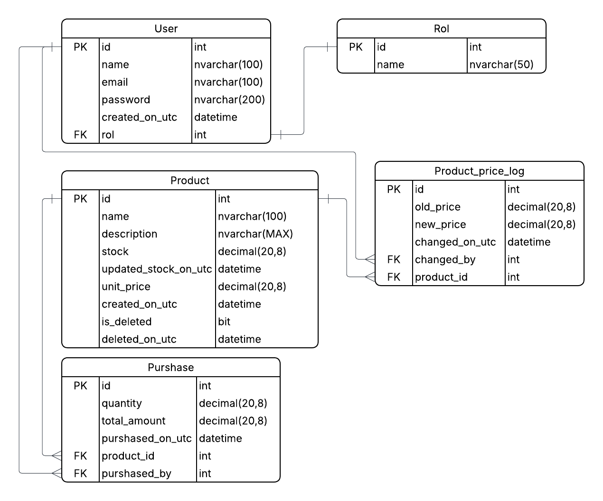

# Store API – C# .NET

## Descripción
Esta API está desarrollada con **C# .NET** siguiendo un **patrón de capas** (Core, Infrastructure, API). Permite la gestión de productos, stock, precios y compras, implementando buenas prácticas de arquitectura, seguridad y patrones de diseño.

En la carpeta Adjunto encontrara la app cliente (C# consola), Script (Tablas, SP, etc) y DR de BDD

---

## Arquitectura
- **Core**: Entidades, DTOs, interfaces de repositorios y servicios.  
- **Infrastructure**: Implementación de repositorios con **Entity Framework** y **Stored Procedures**.  
- **API**: Controladores y servicios que exponen los endpoints.

---

## Seguridad
- Autenticación con **JWT**.  
- Contraseñas con **BCrypt**.  
- Endpoints críticos protegidos con `[Authorize]`.  
- Claims: `idUser`, `nameUser`, `emailUser`, `rolUser`.  

---

## Endpoints principales
- `POST /api/Product` → Insertar un producto.  
  **Body (JSON):**
  ```json
  {
    "name": "string",
    "description": "string",
    "stock": 0,
    "unitPrice": 0
  }
- `GET /api/Product` → Obtener todos los productos.   
- `GET /api/Product?name={name}` → Buscar productos por nombre.  
- `PUT /api/Product/UpdateStock/{productoId}/{newStock}` → Actualizar stock de un producto.  
- `PUT /api/Product/UpdatePrice/{productoId}/{newPrice}` → Actualizar precio y registrar en `ProductPriceLog`.  
- `PUT /api/Product/PurchaseProduct/{productoId}/{quantity}` → Realizar compra y actualizar stock.  
- `POST /api/Auth/login` → Generar JWT.

> Todos los endpoints manejan errores y retornan un **BaseResponse<T>** estandarizado.

---

## Base de datos
- Se utilizó **SQL Server (SQLEXPRESS)** en la máquina local.  
- **Diagrama relacional:**



**Stored Procedures principales:**
- `sp_add_product`  
- `sp_get_all_products_name_asc`  
- `sp_get_products_by_name`  
- `sp_get_product_by_id`  
- `sp_soft_delete_product`  
- `sp_update_product_stock`
-  `sp_update_product_price`  
- `sp_purchase_product`  
- `sp_get_user_by_email`  
---

## Configuración
```csharp
// Cadena de conexión en el cliente y API (Program.cs)
private static string BaseApiUrl = "https://localhost:0000/api/";


// Cadena de conexión (appsettings.json)
// maquina donde corre SQL Server, ejemplo: LAPTOP-0000XXXX**
"ConnectionStrings": {
  "str_connection": "Server={maquina}\\SQLEXPRESS;Database=Store;Trusted_Connection=True;TrustServerCertificate=True;"
}

// Cadena de conexión (appsettings.json)
"Jwt": {
  // Identifica quién emite el token. En este proyecto se configuró como:
  "Issuer": "https://localhost:7234/api/",

  // Define quién puede usar el token. En este proyecto se configuró como:
  "Audience": "https://localhost:7234/api/",
  "TokenValidityInMinutes": "30"
}

